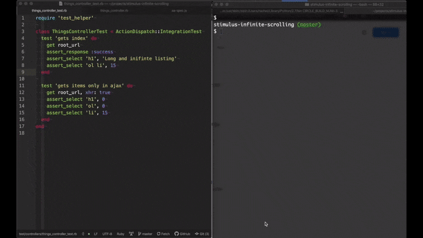

# Road Runner (mac only!)

Run any context-aware command from Atom in Terminal.app using a key shortcut.



To use it, open your Atom configuration file and add commands for each source type.

These are configuration examples for Rails with RSpec and Node with Mocha:

`config.cson`
```cson
".ruby.source":
  "road-runner":
    commands:
      all: "rails test"
      file: "rspec {file}"
      line: "rspec {file}:{line}"

".js.source":
  "road-runner":
    commands:
      all: "npm test"
      file: "mocha {file}"
```

This package was inspired by @moxley's [ruby-test](https://github.com/moxley/atom-ruby-test) atom package and uses @thoughtbot [rspec.vim](https://github.com/thoughtbot/vim-rspec)'s terminal runners.

## Default key bindings

- `CONTROL` + `OPTION` + `'`: `road-runner:run-all` runs your command without any parameter. Example: `rails test`

- `CONTROL` + `OPTION` + `;`: `road-runner:run-file` runs your command by passing the current file path relative to the project root without the line number. Example: `rspec spec/models/user_spec.rb`

- `CONTROL` + `OPTION` + `L`: `road-runner:run-line` runs your command by passing the current file path relative to the project root + the line number. Example: `rspec spec/models/user_spec.rb:8`

- `CONTROL` + `OPTION` + `z`: `road-runner:repeat-last` repeats the last command issued with the previous parameters, even if the current file doesn't match the scope.

## Planned features

- Configuration screen
- Project-aware context
- Also support iTerm
